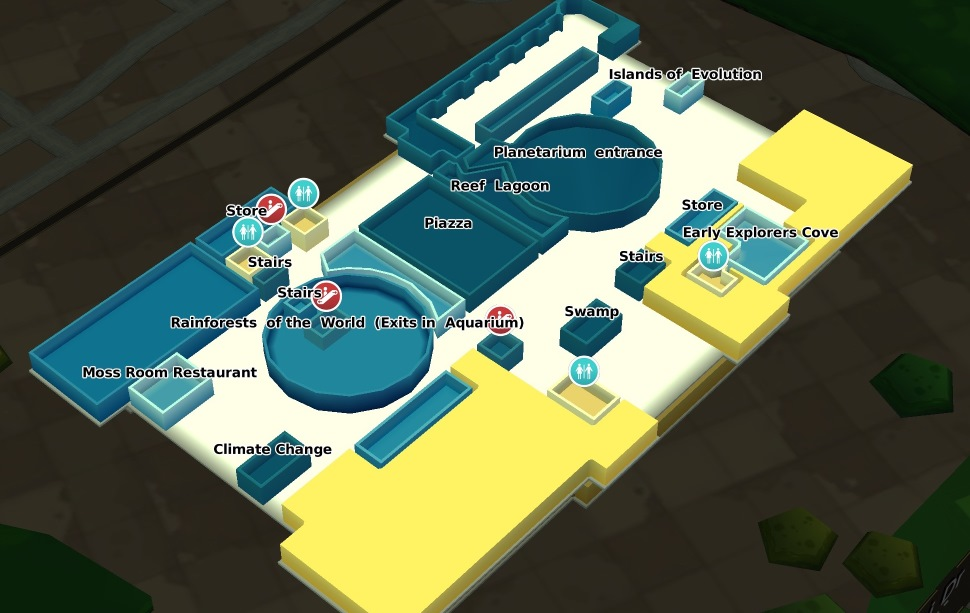

WRLD Indoor Map Format v1.0.0
===================

This document describes version 1.0.0 of the WRLD Indoor Map Format.

---

#### Archive structure

Indoor maps are submitted to the REST API as a specially structured .ZIP archive.  This should contain a file named `main.json`. The main JSON file describes the building and references each of the building’s levels.  Each level’s geometry is then described in a separate GeoJSON file.

```
westport-house.zip/
├── main.json
├── westport-house-floor-gf.geojson
├── westport-house-floor-1.geojson
├── westport-house-floor-2.geojson
├── westport-house-floor-3.geojson
├── westport-house-floor-4.geojson
├── westport-house-floor-5.geojson
└── westport-house-floor-6.geojson
```

Optionally, information on pathways within the building can be supplied in additional files alongside these, for example:
```
westport-house.zip/
├── main.json
├── main-paths.json
├── westport-house-floor-gf.geojson
├── westport-house-floor-gf-paths.geojson
├── westport-house-floor-1.geojson
├── westport-house-floor-1-paths.geojson
...
```

An example of this file structure can be found in the [examples directory.](/examples/)

##### Main JSON file

The main JSON file is named `main.json` sits in the root of the submitted archive, with the GeoJSON files for each level alongside it.  It contains JSON for a Building object, made up of several levels, described below. 

###### Building
|Field|Type|Required|Description|
 --- | --- | --- | ---
|`id`|string|Yes| an identifier for the building
|`name`|string|Yes| the building's name
|`owner`|string|Yes| the owner of the building
|`source_vendor`|string|No, default:"WRLD"| a string identifying the vendor of the building map
|`location`|GeoJSON point|Yes| a [long, lat] coordinate roughly in the center of the building
|`levels`|Level[]|Yes| an array of the levels that make up the building (explained below)
|`entrance_level`|integer|No, default:0| a zero-based index into levels[] stating which floor the interior will open on
 
###### Level
|Field|Type|Description|
 --- | --- | ---
|`id`|string| an identifier for the level
|`name`|string| the abbreviated version of the level’s name (e.g. ‘G’, ‘1’, etc.)
|`readable_name`|string| the level’s full name, e.g. “Ground Floor”, “First Floor”, etc.
|`z_order`|integer| should be 0 for the lowest level and increment by one for each level above that
|`filename`|string| filename of the GeoJSON file containing the features of the level. Must not begin with a period or underscore

###### Example

```json
{
	"id": "westport_house",
	"name": "Westport House",
	"owner": "WRLD",
	"location": {
		"type": "Point",
		"coordinates": [-2.977999, 56.459920]
	},
	"levels": [{
		"id": "westport-house-floor-gf",
		"name": "G",
		"readable_name": "Ground Floor",
		"z_order": 0,
       "filename": "westport-house-floor-gf.geojson"
	},
	{
		"id": "westport-house-floor-1",
		"name": "1",
		"readable_name": "First Floor",
		"z_order": 1,
       "filename": "westport-house-floor-1.geojson"	
	},
    ...
	]
}  
```

##### Level GeoJSONs

The features in each level are specified in the [GeoJSON format](http://geojson.org/geojson-spec.html), exportable from several common GIS tools (QGIS, ArcGIS, etc.).

Each level’s GeoJSON file is expected to contain a FeatureCollection in the WGS84 (EPSG: 4326) Coordinate Reference System.

In addition to the default GeoJSON members, each feature may specify some additional attributes.

###### Attributes

|Attribute|Type|Description|
 --- | --- | ---
|`id`|string|an identifier for the feature
|`name`|string|the feature's name. Will be displayed as a label over certain "Feature Types". Optional, can be null.
|`type`|string|the type of the feature - this should match one of the strings in “Feature Types,” below.
|`highlight`|boolean|whether to generate a highlight for the feature. Optional. Defaults to false.

###### Type specific attributes

###### placeholder

|Attribute|Type|Description|
 --- | --- | ---
|`instance`|string|An instance identifier. Instances names matching an asset in WRLD3D library will be replaced by this asset in the interior. A triangle is generated otherwise.
|`rotation_degrees_over_y`|double|Rotation of the mesh around the vertical axis. [0,360] 
|`position`|array|Pair of coordinates in EPSG 4326 to indicate the position of the mesh center
|`scale`|double|Uniform scale attribute for the mesh. Defaults to 1.0

 
###### Feature Types
|Type|Shows Label|Description|
 --- | --- | --- 
|`bathroom`|Yes| marks out bathrooms in the current level
|`building_outline`|Yes| denotes the area covered by the floor of the building
|`door`|Yes| doors
|`elevator`|Yes| specifies the area taken up by elevator shafts
|`escalator`|Yes| escalators
|`floor_opening`|No| openings in the floor which should be cut away from the area described by the building_outline
|`garden`|Yes| gardens
|`hallway`|Yes| specifies hall areas or corridors
|`highlight`|No| specifies an area of interest
|`inaccessible_space`|No| any space inside the building which is not mapped or accessible
|`no_geometry`|Yes| a feature for which no 3d geometry should be generated
|`placeholder`|No| a feature replaced by a 3d mesh or a placeholder triangle. (e.g. desk, chair, plant, other furnitures ..) 
|`room`|Yes| marks out interior rooms e.g. meeting rooms in an office
|`stairs`|Yes| stairs between levels
|`unit`|Yes| specifies areas around which interior walls should be created (e.g. units in a shopping centre)
|`wall`|Yes| interior walls
|`window`|Yes| windows

All feature types listed are expected to be specified as GeoJSON Polygons. 

##### Label Icons

If a feature is given a label which matches one of the following strings, the text will be replaced with a POI icon. This setting is controlled by the app, and can be modified by [InteriorsEntitiesPinsController.cpp.](https://github.com/wrld3d/wrld-example-app/blob/master/src/InteriorsEntitiesPins/SdkModel/InteriorsEntitiesPinsController.cpp)

|Label|
----
|`Restroom`|
|`Men's Bathroom`|
|`Women's Bathroom`|
|`Bathroom`|
|`Elevator`|
|`Escalator`|
|`Stairs`|


###### Example

```json
{
    "type": "FeatureCollection",
    "features": [ { 
        "type": "Feature", 
        "properties": { 
        	"id": 1,
            "type" : "building_outline",
            "name" : "westport house"
            }, 
        "geometry": { 
            "type": "Polygon",     
            "coordinates": [ [ [ -2.977893780725116, 56.459973605758755 ], [ -2.977893780725116, 56.459923432195168 ], [ -2.977952157716961, 56.459887593898202 ], [ -2.978017021041228, 56.459869674730484 ], [ -2.978081884365498, 56.459858923222477 ], [ -2.97807539803307, 56.459826668682346 ], [ -2.978594304627225, 56.459780078755287 ], [ -2.978620249956932, 56.459901929213025 ], [ -2.978587818294797, 56.459901929213025 ], [ -2.978607277292078, 56.459962854295306 ], [ -2.978574845629944, 56.459970021945622 ], [ -2.978659167951494, 56.460167131799167 ], [ -2.978801867264886, 56.460152796571585 ], [ -2.978827812594594, 56.46024597545415 ], [ -2.978600790959652, 56.460263894443827 ], [ -2.978587818294797, 56.460249559252766 ], [ -2.977965130381813, 56.460324818945473 ], [ -2.977828917400847, 56.459984357270066 ], [ -2.977893780725116, 56.459973605758755 ] ] ] 
            } 
        } ]
}
```

#### Paths

Path information is optional and does not affect the appearance of the map. If paths are present, they will be processed for use by the [WRLD routing service](https://github.com/wrld3d/wrld-routing-api/).  

A path represents a portion of a route by which people can move from place to place within a building. Paths defined in a particular level's path JSON are considered to lie on that level; paths between levels, such as elevators and stairs, must be defined in the main path JSON file.  

Each path GeoJSON file is expected to contain a FeatureCollection in the WGS84 (EPSG: 4326) Coordinate Reference System, and include the appropriate `crs` attribute. Paths are represented as GeoJSON features with LineString geometry. Coordinates on the LineString are points along the path. Paths intersect if they have a point in common on the same level.


###### LineString Feature Types

LineString feature types are used to define pathways by which people can travel within the building. These will not be visible in the map.

|Type|Description|
 --- | --- 
|`pathway`|a pathway, usually on a single level
|`stairs`|a pathway between levels via stairs
|`escalator`|a pathway between levels via an escalator
|`elevator`|a pathway between levels via an elevator

All feature types listed above are expected to be specified as GeoJSON LineStrings.

A LineString feature representing a path may have some additional properties:

|Attribute|Type|Description|
 --- | --- | ---
|`id`|integer|An identifier for the feature. Each path must have a unique id.
|`name`|string|The feature's name, for example, `main corridor`. Optional, can be null.
|`type`|string|The type of the feature. This should match one of the strings in “LineString Feature Types” above.

###### Level path JSON file

Each level path JSON file consists of a FeatureCollection specifying paths contained on a single level. The z_order value for the level is specified in an extra top level attribute.

|Attribute|Type|Description|
 --- | --- | --- 
|`z_order`|integer| z_order of corresponding level as specified in main.json

Note that the `z_order` attribute is an extension of the core GeoJSON format and will not be automatically generated by GIS tools.

###### Example -- level-paths.geojson

```json
{
    "type": "FeatureCollection",
    "features" : [ {
        "type": "Feature", 
        "properties": { 
            "id": 10,
            "type" : "pathway"
        }, 
        "geometry": { 
            "type": "LineString",     
            "coordinates": [ [ -2.977893780725116, 56.459973605758755 ], [ -2.977893780725116, 56.459923432195168 ], [ -2.977952157716961, 56.459887593898202 ] ] 
        } 
    } ],
    "z_order" : 0
}
```

###### Main paths JSON file 

The main-paths.json file consists of a FeatureCollection specifying paths which span multiple levels. It also specifies which files contain single-level path definitions in an extra top-level attribute. 

|Attribute|Type|Description|
 --- | --- | --- 
|`level_filenames`|string[]| Array of filenames of GeoJSON files containing the paths for each level. Filenames must not begin with a period or underscore. This attribute must be present but may be an empty array.

In addition to the default GeoJSON members, paths spanning multiple levels must specify the level for each coordinate in the LineString:

###### Multilevel Path Attributes

|Attribute|Type|Description|
 --- | --- | ---
|`levels`| integer[] | Location of each coordinate, specified using the level's z_order value from main.json. The length of this array must match the `coordinates` array in the LineString geometry.

Note that the `levels` attribute is an extension of the core GeoJSON format and will not be automatically generated by GIS tools.

###### Example -- main-paths.json

This example shows how to define a path between floors via an elevator.
This is represented by a path between the same [long, lat] point on different levels.  The specified point should also be present on a path defined for each level, to allow a route from the elevator to other points on the level.

```json
{
    "type": "FeatureCollection",
    "features" : [ {
        "type": "Feature", 
        "properties": { 
            "id": 10,
            "type" : "elevator"
        }, 
        "geometry": { 
            "type": "LineString",     
            "coordinates": [ [ -2.977893780725116, 56.459973605758755 ], [ -2.977893780725116, 56.459973605758755 ], [ -2.977893780725116, 56.459973605758755 ] ] 
        },
        "levels" : [ 0, 1, 2 ]
    } ],
    "level_filenames" : [ 
      "westport-house-floor-gf-paths.geojson",
      "westport-house-floor-1-paths.geojson",
      "westport-house-floor-2-paths.geojson"
    ]
}
```
---

#### Disclaimer
This is a stable, semantically versioned Format.

WRLD may make changes to the Format from time to time but will adhere to [Semantic Versioning](http://semver.org/) and provide backward compatible end points for as long as possible.

---

#### Contact us
If you have any problems or queries please [raise an issue](https://github.com/wrld3d/wrld-indoor-maps-api/issues/new) or alternatively get in touch with us at support@wrld3d.com.

