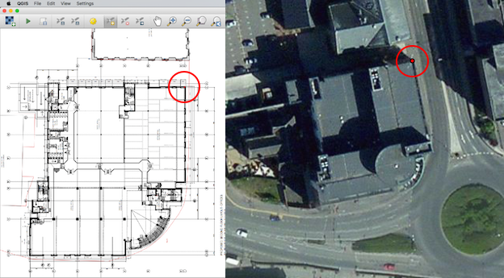
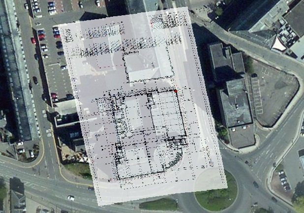

Submitting your indoor map to eeGeo
===================
eeGeo’s 3D Indoor Maps offering is available and we are now accepting submissions. If you’re interested in seeing your building’s indoor space in our immersive 3D maps, read on!

This post covers creating an indoor map by georeferencing floor plan imagery and then submitting it to the eegeo indoor maps submission service. You can follow along on Mac OS X, Linux or Windows.

eeGeo's office building, Westport House, will be used as the example for this post. The owners have kindly given us permission. Please note that if you do not have the building owner’s approval to submit a map to the service, your submission will be rejected.

( TODO : image showing floor plan )
( TODO : image showing corresponding indoor map in eeGeo tech )

For detailed information on the eeGeo Indoor Map format, please refer to the [format documentation](FORMAT.md). 

A rough outline of the process:

1. [Install the required software](#install-software)
1. [Georeference the floor plan image](#georeference-floor-plan)
1. [Create a indoor map level](#create-indoor-map-level)
1. [Export the level to GeoJSON](#export-level-to-geojson)
1. [Create the main JSON file](#create-main-json-file)
1. [Package your map for submission](#create-map-package)
1. [Submit to the eeGeo Indoor Maps Submission Service](#submit-package)

---

#### <a name="install-software"/>Install the required software
Pre-requisites:
- A floor plan image (tif, png or bmp) for each of the floors you wish to submit.
- [QGIS](https://www.qgis.org/en/site/forusers/download.html) (2.12 Lyon at the time of writing) with the Georeferencer and OpenLayers plugins (**Note**: Other GIS software such as [ArcMap](http://desktop.arcgis.com/en/arcmap/) is available, but we're using QGIS for this guide as it's free).
- [curl](https://curl.haxx.se/download.html) (comes as standard on OS X and Linux).

We're using QGIS in this example because it's free and easily available.  If you have access to other GIS software though, anything that supports georeferencing, polygon creation and exports to GeoJSON should work, although of course you'll need to adapt the instructions below as appropriate.

Install and run QGIS, then ensure you have access to the [Georeferencer](http://docs.qgis.org/2.2/en/docs/user_manual/plugins/plugins_georeferencer.html) plugin (under Raster > Georeferencer). On Windows, this functionality comes as standard. On OS X and Linux, you may have to install it via the plugins manager (Plugins > Manage and Install Plugins > Search for “Georeferencer” > Choose “Georeferencer GDAL” > click “Install Plugin”).

We’d also recommend you install the [OpenLayers](http://docs.qgis.org/2.2/en/docs/training_manual/qgis_plugins/plugin_examples.html?highlight=openlayers#basic-fa-the-openlayers-plugin) plugin. OpenLayers allows you to pull map & satellite imagery into your QGIS scene. This makes certain steps of the process much easier, as you can line up your indoor map features with the OpenLayers imagery.

**Note**: For advanced users accustomed to GIS packages, if you have access to useful data (such as a shapefile for the building that contains your indoor map), feel free to use these, as they’ll likely be more accurate than OpenLayers data.

---

#### <a name="georeference-floor-plan"/>Georeference the floor plan image
If you have an image of your building’s floor plan, you can use [georeferencing](https://en.wikipedia.org/wiki/Georeference) to help turn it into a map. Unfortunately, images do not contain geographic location data so while they may be detailed and legible, there’s nothing to associate the contents of the image with spatial locations in the world, or orient it correctly.  

[Georeferencing](https://en.wikipedia.org/wiki/Georeference) basically means saying ‘point **P** on the image is at geographic coordinate **Q**’. This will allow you to view your floor plan image in QGIS with the correct location and orientation. 

- Open QGIS and add a layer of your choice via OpenLayers (e.g. to add an Open Street Map layer, choose Web > OpenLayers plugin > and then choose a layer -- experiment with each to see which one best suits your location of interest).
- Browse to your building’s location via left-click dragging & zooming with the mouse wheel.
- Open the Georeferencer (Raster > Georeferencer > Georeferencer).
  
  
- Click “Add Raster”.
- Add your floor plan image. If you’re using OpenLayers, set the CRS (coordinate reference system) as WGS84 / Pseudo Mercator ([EPSG: 3857](http://spatialreference.org/ref/sr-org/6864/)).
- The image should be displayed in the Georeferencer window.

  [](/images/tutorial/georeference_plan.png) 
- The next step involves selecting a point on the indoor map image and then assigning it a location.
- In the Georeferencer window, ensure the “Add Point” tool selected and left click the first point to be referenced (a corner is a good choice).
- Click the “From map canvas” button.
- Left click the location on the map matching the point you’ve just selected.
  
  
- Repeat this process for a handful of points on the building perimeter; try to pick the points that are clearly visible on the map (e.g. building corners). Inaccurately georeferenced points cause distortion, so if in doubt, don't add it (in this example, only 4 points were georeferenced).
- Open the settings dialog. Choose a filename for “Output raster”. If you're using OpenLayers, the Target SRS should be set to [EPSG:3857](http://spatialreference.org/ref/sr-org/6864/). Otherwise, set it the QGIS project's CRS; to check this, choose Project > Project Properties > CRS. The rest of the options should roughly match the following:
  
  
- Click the “OK” button.
- Click the “Start Georeferencing” button.
- The transformed image should open in the QGIS main scene view.
  
  
- If nothing appeared, you likely forgot to check the “Load in QGIS when done” box. You can drag the georeferenced TIF into QGIS, or simply re-export with the box checked.
- In the Layers panel, locate the layer that’s just been added. Double click it, adjust with style and transparency so you can see the underlying map imagery.
- If the result is sub-par and heavily distorted, try the process again and choose different points to georeference. Again, fewer is often better.

---

#### <a name="create-indoor-map-level"/>Create an indoor map level

We’ve now got a georeferenced floor plan image, and we’re ready to begin tracing the indoor map features for a single building level. For the purposes of this tutorial, we're tracing the westport house floor that houses the eeGeo offices -- this is the second level.

- Set the opacity on your floor plan image layer fully opaque once more.
- Create a new QGIS layer via Layer > Create Layer > New Shapefile Layer.
- When prompted, choose the Type: Polygon radio button option, then choose the appropriate CRS (again, this is typically [EPSG:3857](http://spatialreference.org/ref/sr-org/6864/) unless your QGIS project is using something else).
- Finally, add “type” and “name” to the attribute list (under “New attribute”, fill in the attribute name and click the “Add to attributes list” button). The default data types are fine (String, 80 width).
  
  
- Click “OK”.
- Give your new layer a suitable name. Something like my-indoor-map-name-level-x is good (where level-x corresponds to whatever floor of the building you're about to create).

  
- Ensure that your new feature layer is selected in the Layers panel
- In the layers panel, left click & drag the new feature layer to the top of the panel (we need our new layer to be the top-most layer, or it will be hidden by the others).
- Open the Layer Style menu (Layer > Properties > Style) and move the transparency slider to 50%. 
  
  This allows you to see through to the floor plan image layer, which makes tracing easier. Furthermore, it's expected that polygons will overlap; setting the transparency helps us make sense of overlaps (overlapping polygons will are shaded darker).

- The first feature we’re going to create is an outline of this particular indoor map level. A building outline will be used to create geometry for the level's floor plane. 
- Click the “Toggle Editing” button.
  
  
- Click the “Add Features” button.
  
  
- Trace the boundary of the floor plan image by drawing a polygon, one point at a time (don't worry about geometry warnings).
- When you’re happy with the polygon, right click to accept it.
- In the confirmation dialog, select the ‘type’ field and change its value to `building_outline`. 
 
  Leave the id as *NULL*. While it is possible to manually enter ids after creating each feature, I prefer to leave them as NULL and fix them later. I would recommend this, as it's less error-prone.

  
- You should now have a building outline polygon in your QGIS layer. 

  
- We've now got our building outline; the next thing to do is create some rooms. 

  Identify a room on the floor plan image and create a polygon, matching the floor plan as closely as possible. When prompted for details, set its type to "room" and give it a name, if applicable.
  
  
  
  Repeat this step multiple times to give your indoor map more detail. There are multiple feature types to choose from, please refer to the [format documentation](FORMAT.md#feature-types). 
  
  Depending on the layout of the building that's being traced, it may be better to leave space between rooms. The building outline we added in the first step will still show up here. This is a useful technique for corridors and other such spaces.
  
  We'd recommend building out a first version, examining the result and then creating further iterations with slight tweaks to the way features are categorised. Here's an image showing Westport House with a handful of rooms (each room is shaded a slightly different color of red).
  
  
- Finally, let’s fix up the feature ids (if you’ve been manually entering ids after creating polygons, these steps are not necessary and can safely be skipped).
  
  Each feature needs an id, and the id must be unique **across all levels of your indoor map** (e.g. if level 1 has a room with an id of 1 and level 2 also has a room with the same id of 1, it is illegal).

  Thankfully, we can use QGIS's Field Calculator feature to generate ids for a level.
  
- Open the layer’s attribute table via Layer > Attribute Table
- Click the Field Calculator button.
  
  
- Change the checkbox to “Update existing field”
- In the combobox, select the “id” field
- In the left hand expression box enter the following: 
  
  `toint(concat('n', tostring(@row_number)))` 
  ... where `n` is the floor/level number
  
  Replace 'n' for your level's number (but, keep the single quotes).  

  E.g. for the second level of our indoor map, we'd modify the above to:
  
  `toint(concat('2', tostring(@row_number)))`
- If you were generating ids for level 2 of your indoor map, the dialog would look something like:

  
- Click “OK”. 
  
  This will generate unique features ids. Each feature id starts with the interior level id (e.g., level 2 features will have ids 21, 22, 23..., level 3 features will have ids 31, 32, 33...)

- Verify the ids have been generated correctly by opening the layer's Attribute Table

  Layer > Open Attribute Table
  
  Here's Westport House level 2 with auto-generated ids:
  
  

---

#### <a name="export-level-to-geojson"/>Export the level to GeoJSON

- Highlight the layer you created in the Layers panel
- Right click and choose “Save As…”
- Under format, choose GeoJSON
- Change the CRS setting to WGS84 ([EPSG: 4326](http://spatialreference.org/ref/epsg/4326/))
- Enter a filename/location
- Click “OK”

You now have a single level of your building digitised. If you have more floor plans for your building, simply repeat the above steps for each level. 

**Note**: It's often useful to examine the exported json, but QGIS exports unformatted json which makes it tough to read due to the lack of indenting. 

This is entirely optional, but if you wish to re-format your GeoJSON files, you can paste them into [jsonlint](http://jsonlint.com) or run a single command from a terminal (this assumes python is installed and in your path):

```sh
$ cat unformatted.geojson | python -m json.tool > formatted.geojson
```

---

#### <a name="create-main-json-file"/>Create the main JSON file

Now that you have one or more levels of your building traced and exported in an eeGeo-friendly format, the next step is to create the main JSON file. This contains some general information such as contact details. It also references the levels you’ve just created.  The [format documentation](FORMAT.md) explains how to set up the file.

---

#### <a name="create-map-package"/>Package your map for submission

- Place all of the indoor map files (the main GeoJSON file and the level GeoJSON file[s]) and place them in a directory (e.g. `~/my-indoor-map`)
- Zip the directory
- On OS X / Linux, you can do this via opening a terminal and entering the following commands:
```
$ cd ~/my-indoor-map
$ zip -r my-indoor-map.zip .
```
- On Windows, navigate to the directory containing your indoor map files
  - Right click > New > Compressed (zipped) Folder and choose an appropriate name
  - Drag the .json & .geojson files onto the .zip file
- Verify that the .zip structure matches the one given in the [format documentation](FORMAT.md#archive-structure)

---

#### <a name="submit-package"/>Submit to the eeGeo Indoor Maps Submission Service

Now that you have your archive in eeGeo’s format, you can submit it to our Indoor Map Submission API to make it part of our 3D world.  Note that for all of these commands, you’ll need to include your developer authentication token, which you can find on the [api keys](https://www.eegeo.com/developers/apikeys/) page.  If you haven’t signed up yet, please take a moment to do so now.

The first step is to make a post request to our submission service, which is accessible via a simple [REST API](https://en.wikipedia.org/wiki/Representational_state_transfer).  [CURL](https://curl.haxx.se/) commands are shown here as examples.  Required parameters include contact details for the rights holders of the building you’re submitting, to allow eeGeo to confirm that correct approval has been given for the map submission.  We also request that you submit a version of your map archive which contains at least the outline of the area you will be editing, so that this can be verified against existing map records.
```sh
$ curl -v -XPOST https://indoor-map-submission.eegeo.com/venue-edits/?token=dev_auth_token -F venue_street_address="<address>" -F venue_phone_number="<phone no.>" -F venue_email="<email address>" -F venue_outline="@/path/to/my/file"
```
On successful completion of this request, you should receive a JSON packet containing a [UUID](https://en.wikipedia.org/wiki/Universally_unique_identifier).  Please make note of this UUID, as subsequent API calls will need to refer to it. 
```json
{"uuid":"ad578b1f-d3d6-46ed-8945-787527d1efe0"}
```
At this point your edit will be in the *AwaitingApproval* state and will need to be moved into the *ApprovedForSubmission* state by eeGeo before it can be added to the world.  You can periodically query the status of the edit with the following command (note that you’ll need to replace the UUID shown with the one that was returned by your initial POST request):
```sh
$ curl -v https://indoor-map-submission.eegeo.com/venue-edits/ad578b1f-d3d6-46ed-8945-787527d1efe0/status?token=dev_auth_token
```
Once your edit has been approved, you should see this response from a status query:
```json
{"status":"ApprovedForSubmission"}
```
You will no be able to upload your indoor map for compilation using the following PUT request.  Again, you’ll need to replace the UUID with the one you got in response to your original POST request.
```sh
$ curl -v -XPUT https://indoor-map-submission.eegeo.com/venue-edits/ad578b1f-d3d6-46ed-8945-787527d1efe0?token=dev_auth_token -F name="my venue name" -F comment="my venue comment" -F file="@/path/to/my/file"
```
When your submission has been processed we will send you the details required to view it using the eeGeo SDK.  
If at any time you decide you’d rather delete your edit, you can do so with the following command:
```sh
$ curl -v -XDELETE https://indoor-map-submission.eegeo.com/venue-edits/ad578b1f-d3d6-46ed-8945-787527d1efe0?token=dev_auth_token
```
If you have any problems, the [cheatsheet](https://github.com/eegeo/indoor-map-submission/blob/master/CHEATSHEET.md) might be able to help, or feel free to [raise an issue](https://github.com/eegeo/indoor-map-submission/issues/new) or get in touch with us at support@eegeo.com.
